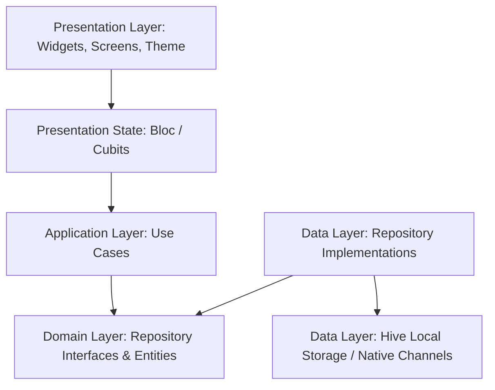

<div align="center">

# 💰 MoneyMan

### Modern, Privacy-First Personal Income & Expense Tracker for Android

[](https://github.com/jakegithub24/MoneyMan-App/releases)
[](https://flutter.dev)
[](https://dart.dev)
[](https://bloclibrary.dev)
[](https://docs.hivedb.dev)
[](https://flutter.dev)

<p align="center">
  <b>MoneyMan</b> is a privacy-focused, 100% offline, and beautifully crafted personal finance application designed to help you track income, manage expenses, monitor monthly target budgets, and gain deep visual insights into your cashflow trends.
</p>

</div>

---

## 📑 Table of Contents

- [✨ Key Features](#-key-features)
- [📦 Download & Installation](#-download--installation)
- [🏛️ Architecture](#️-architecture)
- [📂 Project Structure](#-project-structure)
- [🛠️ Tech Stack & Dependencies](#️-tech-stack--dependencies)
- [🚀 Getting Started](#-getting-started)
- [🔨 Building Release APK](#-building-release-apk)
- [🧪 Running Tests](#-running-tests)
- [🔒 Security & Privacy](#-security--privacy)
- [💾 Data Management (CSV Import & Export)](#-data-management-csv-import--export)
- [🎨 Design & UI Philosophy](#-design--ui-philosophy)

---

## ✨ Key Features

### 📊 Dashboard & Financial Overview
- **Real-Time Summary**: Instant overview of Total Income, Total Expenses, and Net Balance for any selected timeframe (*Today, This Week, This Month, This Year, All Time*).
- **Monthly Target Budgeting**: Live progress tracker calculating spending against your monthly target budget with remaining balance and percentage indicators.
- **Interactive Multi-Graph Breakdown**:
  - **Pie Chart Mode**: Interactive category distribution with a toggle between **Expense** and **Income**. Tapping any slice or legend item immediately navigates to **Transactions** with that category and transaction type pre-filtered.
  - **Line Chart Mode**: Multi-series line chart tracking **Income** (green) and **Expenses** (red) over 4-hour slots (*Today*), daily intervals (*This Week*, *This Month*), monthly trends (*This Year*), and 10-year aggregated intervals with horizontal scrollable set buttons (*All Time*).
  - **Interactive Tooltips**: Drag and touch over points to inspect exact amounts and interval dates formatted in the active currency.
- **Quick Action Triggers**: Instant one-tap buttons for adding income or expenses directly from the dashboard.

### 📝 Transaction Management
- **Full CRUD Support**: Add, view, edit, search, and delete transactions with swipe-to-dismiss (with instant Undo action).
- **Recurring Transactions**: Complete support for recurring transaction schedules (*Daily, Weekly, Monthly, Yearly*).
- **Comprehensive Filtering & Live Search**: Filter transactions by Type (*Income, Expense, Recurring*), Category, Custom Date Range, or live search query (*notes, merchants, amounts, categories*).
- **Date Integrity Safeguards**: Guardrails preventing future transaction dates from being recorded or imported.

### 🏷️ Customizable Categories
- **Custom Category Creation**: Add new custom categories with customizable Material icons and tailored color palettes.
- **System Defaults & Management**: Full control to delete, manage, or restore default and user-created categories.
- **FAB Protection**: Intelligent bottom spacers preventing floating action button underlapping.

### 🔐 Security & Privacy
- **PIN Lock Screen**: 4-digit security PIN protection with masked numeric keypads and tactile vibration feedback.
- **Biometric Authentication**: Fingerprint & Face Unlock integration via `local_auth`.
- **DRM & Screen Capture Protection**: Native hardware-backed `FLAG_SECURE` DRM protection blocking screenshots and screen recording across the entire application (can be enabled instantly; requires PIN verification to disable).
- **Configurable Auto-Lock**: Inactivity timer (*1 min, 5 min, 10 min, 30 min, 1 hour*) tracked via app lifecycle and user interaction observers.
- **Guarded App Reset**: Database reset workflow featuring explicit confirmation warnings before PIN authorization to prevent accidental data wipes.

### 🌐 Multi-Currency & Locale Support
- **International Currencies**: Support for INR (₹), USD ($), EUR (€), GBP (£), JPY (¥), CAD ($), AUD ($), and more.
- **Smart Notation**: Intelligent formatting with Indian Lakhs/Crores notation for INR and Western Millions notation for international currencies.

### 📴 100% Offline & Private
- **Local Hive NoSQL Storage**: Zero tracking, zero telemetry, and completely functional offline.
- **CSV Data Portability**: Full backup and restore capabilities using MoneyMan CSV format.

---

## 📦 Download & Installation

You can download the latest official stable release APK directly from the [GitHub Releases](https://github.com/jakegithub24/MoneyMan-App/releases) page.

| File | Target Android | Architecture |
|---|---|---|
| `MoneyMan-release-v1.0.0.apk` | Android 5.0 (API 21) & above | `arm64-v8a`, `armeabi-v7a`, `x86_64` |

---

## 🏛️ Architecture

MoneyMan follows **Clean Architecture** principles and **Feature-Driven Development**:



- **Domain Layer**: Contains plain Dart entities (`Expense`, `CategoryItem`, `CurrencyItem`), business models (`ExpenseSummary`), and repository contracts. Pure Dart with zero Flutter framework dependencies.
- **Application Layer**: Isolated use cases (`AddExpenseUseCase`, `ListExpensesUseCase`, `GetSummaryUseCase`, `DeleteExpenseUseCase`, `UpdateExpenseUseCase`).
- **Data Layer**: Concrete repository implementations (`ExpenseRepositoryImpl`, `CategoryRepositoryImpl`) interfacing with Hive boxes (`ExpenseHiveDatasource`, `CategoryHiveDatasource`).
- **Presentation Layer**: State management using **Bloc / Cubit** (`DashboardCubit`, `ExpenseListCubit`, `CategoryCubit`, `CurrencyCubit`) providing reactive, immutable state to Flutter UI widgets.

---

## 📂 Project Structure

```
lib/
├── application/
│   └── use_cases/                # Business logic use cases (CRUD & Summaries)
├── data/
│   ├── datasources/              # Hive box adapters and local storage access
│   └── repositories/             # Concrete repository implementations
├── domain/
│   ├── entities/                 # Core domain entities (Expense, CategoryItem, etc.)
│   ├── models/                   # Summary models & cashflow projections
│   └── repositories/             # Domain repository contracts & interfaces
├── presentation/
│   ├── constants/                # Default categories and icon mappings
│   ├── screens/                  # App screens (Dashboard, Transactions, Settings, PIN, etc.)
│   ├── state/                    # Cubits and states for each feature
│   ├── theme/                    # AppTheme (colors, typography, component styles)
│   ├── utils/                    # Haptics, Formatters, Permission Helpers
│   └── widgets/                  # Reusable UI widgets (PieChart, LineChart, Dialogs, Tiles)
└── main.dart                     # App entry point & dependency injection wiring
```

---

## 🛠️ Tech Stack & Dependencies

| Category | Package / Tool | Purpose |
|---|---|---|
| **Framework** | [Flutter SDK](https://flutter.dev) | Cross-platform UI toolkit |
| **State Management** | [flutter_bloc](https://pub.dev/packages/flutter_bloc) | Predictable state container & Cubits |
| **Database** | [hive](https://pub.dev/packages/hive) / [hive_flutter](https://pub.dev/packages/hive_flutter) | Ultra-fast local NoSQL key-value storage |
| **Charts** | [fl_chart](https://pub.dev/packages/fl_chart) | Interactive Pie & Multi-series Line charts |
| **Biometrics** | [local_auth](https://pub.dev/packages/local_auth) | Fingerprint & Face Unlock authentication |
| **Permissions** | [permission_handler](https://pub.dev/packages/permission_handler) | Runtime storage permission management |
| **Formatting** | [intl](https://pub.dev/packages/intl) | Internationalization & date formatting |
| **Icons & Fonts** | [google_fonts](https://pub.dev/packages/google_fonts) | Custom typography and typography scales |
| **Identifiers** | [uuid](https://pub.dev/packages/uuid) | Unique ID generation for transactions and categories |

---

## 🚀 Getting Started

### Prerequisites
- [Flutter SDK](https://docs.flutter.dev/get-started/install) (`>= 3.12.0`)
- [Android Studio](https://developer.android.com/studio) or [VS Code](https://code.visualstudio.com/) with Flutter extension
- Android Device or Emulator (API level 21+)

### Installation & Run

1. **Clone the repository:**
   ```bash
   git clone https://github.com/jakegithub24/MoneyMan-App.git
   cd MoneyMan-App
   ```

2. **Install dependencies:**
   ```bash
   flutter pub get
   ```

3. **Verify analyzer status:**
   ```bash
   flutter analyze
   ```

4. **Run on connected device / emulator:**
   ```bash
   flutter run
   ```

---

## 🔨 Building Release APK

To build an optimized production release APK:

```bash
# Build release APK
flutter build apk --release

# The compiled APK is available at:
# build/app/outputs/flutter-apk/app-release.apk
```

---

## 🧪 Running Tests

The test suite includes comprehensive unit, use-case, and widget tests:

```bash
# Run all tests
flutter test

# Run specific test suites
flutter test test/breakdown_chart_test.dart       # Pie & Line chart breakdowns
flutter test test/expense_usecases_test.dart      # Business logic & use cases
flutter test test/pie_chart_navigation_test.dart  # Chart navigation & deep filtering
flutter test test/security_settings_test.dart     # PIN, biometrics & auto-lock
flutter test test/drm_protection_test.dart        # Native FLAG_SECURE DRM protection
flutter test test/reset_app_data_test.dart        # Safe database reset workflow
flutter test test/currency_formatter_test.dart    # International & Indian currency formats
flutter test test/back_navigation_test.dart       # Gesture & back button navigation
```

---

## 🔒 Security & Privacy

MoneyMan is designed with zero compromises on security:
- **100% On-Device**: No data ever leaves your device; zero network calls for data storage.
- **Hardware-Level DRM Protection**: Prevents screen capturing or background recording of financial records via `FLAG_SECURE`.
- **Guarded App Reset**: Resetting application data requires explicit confirmation followed by PIN authorization.
- **Configurable Auto-Lock**: Automatically locks the app when backgrounded or inactive.

---

## 💾 Data Management (CSV Import & Export)

- **CSV Export**: Export your complete transaction history or filtered segments (*Income*, *Expense*, custom date ranges) into CSV.
- **CSV Import**: Seamlessly restore data from previously exported MoneyMan CSV files with built-in validation checks and future-date safeguards.

---

## 🎨 Design & UI Philosophy

- **Modern Dark Theme**: Tailored with eye-friendly contrast, sleek card borders, and refined color indicators for income (green) and expense (coral/red).
- **Tactile Haptic Feedback**: Dynamic vibration impacts on button presses, keypad inputs, and interactions for a responsive native feel.
- **Smooth Gestures**: Intuitive tab navigation and swipe-to-dismiss actions.

---

<div align="center">
  <sub>Developed with ❤️ by <a href="https://github.com/jakegithub24">JakeGithub24</a> using Flutter & Dart</sub>
</div>
