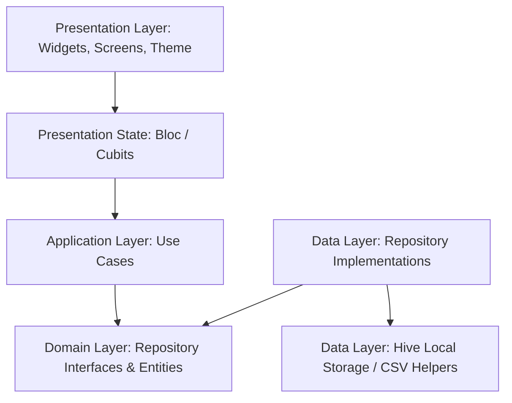

<div align="center">

# 💰 MoneyMan

### Modern Personal Income & Expense Tracker for Android & Flutter

[](https://flutter.dev)
[](https://dart.dev)
[](https://bloclibrary.dev)
[](https://docs.hivedb.dev)
[](https://flutter.dev)

<p align="center">
  <b>MoneyMan</b> is a privacy-first, offline, and beautifully crafted personal finance application designed to help you track income, monitor expenses, stay within budget limits, and gain clear visual insights into your spending habits.
</p>

</div>

---

## 📑 Table of Contents

- [✨ Key Features](#-key-features)
- [🏛️ Architecture](#️-architecture)
- [📂 Project Structure](#-project-structure)
- [🛠️ Tech Stack & Dependencies](#️-tech-stack--dependencies)
- [🚀 Getting Started](#-getting-started)
- [🧪 Running Tests](#-running-tests)
- [🔒 Security & Privacy](#-security--privacy)
- [💾 Data Management (CSV Import & Export)](#-data-management-csv-import--export)
- [🎨 Design & UI Philosophy](#-design--ui-philosophy)

---

## ✨ Key Features

### 📊 Dashboard & Financial Overview
- **Real-Time Summary**: Instant overview of Total Income, Total Expenses, and Net Balance for any selected timeframe (Today, This Week, This Month, This Year, All Time).
- **Monthly Target Budgeting**: Live progress tracker calculating spending against monthly target budget with remaining balance and percentage indicators.
- **Interactive Pie & Line Breakdown**: 
  - **Pie Mode**: Category breakdown for Income or Expenses with one-tap navigation to filtered Transactions.
  - **Line Mode**: Multi-series line charts tracking income (green) and expenses (red) over 4-hour slots, daily, monthly, or 10-year intervals with scrollable set selectors.
- **Quick Action Triggers**: Fast one-tap buttons for adding income or expenses directly from the dashboard.

### 📝 Transaction Management
- **Full CRUD Support**: Add, view, edit, search, and delete transactions with swipe-to-dismiss (including Undo action).
- **Recurring Transactions**: Support for recurring transaction schedules (Daily, Weekly, Monthly, Yearly).
- **Powerful Filtering & Search**: Filter transactions by Type (Income, Expense, Recurring), Category, Date Range, or live search query (notes, merchants, amounts).
- **Date Integrity**: Guardrails preventing future transaction dates.

### 🏷️ Customizable Categories
- **Custom Category Creation**: Add new custom categories with custom icons and tailored color palettes.
- **System Defaults & Management**: Full control to delete or manage both default and user-created categories.
- **FAB Protection**: List padding spacers preventing floating action button underlapping.

### 🔐 Security & Privacy
- **PIN Lock Screen**: 4-digit security PIN protection with masked keypads and randomized vibration feedback.
- **Biometric Authentication**: Fingerprint & Face Unlock integration via `local_auth`.
- **DRM & Screen Protection**: Hardware-backed `FLAG_SECURE` DRM protection blocking screenshots and screen recording across the application (enable without PIN; disable requires PIN verification with biometrics excluded).
- **Auto-Lock Interval**: Configurable inactivity auto-lock (1 min, 5 min, 10 min, 30 min, 1 hour) tracked via lifecycle and activity listeners.
- **Safe Reset Safeguards**: Database reset workflow featuring explicit confirmation dialogs before PIN authorization to prevent accidental data wipes.

### 🌐 Multi-Currency & Locale Support
- **International Currencies**: Support for INR (₹), USD ($), EUR (€), GBP (£), JPY (¥), CAD, AUD, and more.
- **Indian & Western Number Formats**: Intelligent formatting with Indian Lakhs/Crores notation for INR and Western Millions notation for international currencies.

### 📴 Privacy-First & Offline Storage
- **100% Local Hive Database**: Zero telemetry, no third-party tracking, and completely offline-functional.
- **CSV Export & Import**: Export filtered transactions or restore data using MoneyMan-compatible CSV formats with storage permission management.

---

## 🏛️ Architecture

MoneyMan follows **Clean Architecture** principles and **Feature-Driven Development**, maintaining clear separation of concerns across layers:



- **Domain Layer**: Contains plain Dart entities (`Expense`, `CategoryItem`, `CurrencyItem`), business rules, models (`ExpenseSummary`), and repository interfaces. Free from Flutter framework dependencies.
- **Application Layer**: Isolated use cases (`AddExpenseUseCase`, `ListExpensesUseCase`, `GetSummaryUseCase`, `DeleteExpenseUseCase`, `UpdateExpenseUseCase`).
- **Data Layer**: Concrete repository implementations (`ExpenseRepositoryImpl`, `CategoryRepositoryImpl`) interfacing with Hive boxes (`ExpenseHiveDatasource`, `CategoryHiveDatasource`).
- **Presentation Layer**: State management using **Bloc / Cubit** (`DashboardCubit`, `ExpenseListCubit`, `ExpenseFormCubit`, `CategoryCubit`, `CurrencyCubit`) feeding immutable states to Flutter UI widgets.

---

## 📂 Project Structure

```
lib/
├── application/
│   └── use_cases/                # Business logic use cases (CRUD & Summaries)
├── data/
│   ├── datasources/              # Hive box adapters and local data access
│   └── repositories/             # Repository implementations
├── domain/
│   ├── entities/                 # Core domain entities (Expense, CategoryItem, etc.)
│   ├── models/                   # Summary models & projections
│   └── repositories/             # Domain repository contracts
├── presentation/
│   ├── constants/                # Default categories and icon sets
│   ├── screens/                  # App screens (Dashboard, Transactions, Settings, PIN, etc.)
│   ├── state/                    # Cubits and states for each feature
│   ├── theme/                    # AppTheme (colors, typography, component styles)
│   ├── utils/                    # Haptics, Formatters, Permission Helpers
│   └── widgets/                  # Reusable widgets (PieChart, Dialogs, FilterBars, Tiles)
└── main.dart                     # App entry point & dependency injection wiring
```

---

## 🛠️ Tech Stack & Dependencies

| Category | Package / Tool | Purpose |
|---|---|---|
| **Framework** | [Flutter SDK](https://flutter.dev) | Cross-platform UI toolkit |
| **State Management** | [flutter_bloc](https://pub.dev/packages/flutter_bloc) | Predictable state container & Cubits |
| **Database** | [hive](https://pub.dev/packages/hive) / [hive_flutter](https://pub.dev/packages/hive_flutter) | Lightweight, ultra-fast NoSQL key-value storage |
| **Charts** | [fl_chart](https://pub.dev/packages/fl_chart) | Interactive and customizable charts |
| **Biometrics** | [local_auth](https://pub.dev/packages/local_auth) | Fingerprint & Face unlock authentication |
| **Permissions** | [permission_handler](https://pub.dev/packages/permission_handler) | Android storage permissions management |
| **Formatting** | [intl](https://pub.dev/packages/intl) | Internationalization & date formatting |
| **Icons & Fonts** | [google_fonts](https://pub.dev/packages/google_fonts) | Custom typography and typography scales |
| **Identifiers** | [uuid](https://pub.dev/packages/uuid) | Unique ID generation for transactions and categories |

---

## 🚀 Getting Started

### Prerequisites
- [Flutter SDK](https://docs.flutter.dev/get-started/install) (version `>= 3.12.0`)
- [Android Studio](https://developer.android.com/studio) or [VS Code](https://code.visualstudio.com/) with Flutter extension
- Android Device or Emulator (API level 21+)

### Installation & Run

1. **Clone the repository:**
   ```bash
   git clone https://github.com/jakegithub24/MoneyMan-App.git
   cd MoneyMan-App
   ```

2. **Install dependencies:**
   ```bash
   flutter pub get
   ```

3. **Verify analyzer status:**
   ```bash
   flutter analyze
   ```

4. **Run on connected device / emulator:**
   ```bash
   flutter run
   ```

---

## 🧪 Running Tests

The repository includes comprehensive unit, use-case, and widget tests covering all features:

```bash
# Run all tests
flutter test

# Run a specific test suite
flutter test test/expense_usecases_test.dart
flutter test test/pie_chart_navigation_test.dart
flutter test test/security_settings_test.dart
flutter test test/reset_app_data_test.dart
```

---

## 🔒 Security & Privacy

MoneyMan is built with privacy as a foundational principle:
- **No Cloud Required**: Your financial records remain stored strictly on your device.
- **Protected Database Reset**: Resetting application data requires explicit confirmation followed by PIN authorization.
- **Configurable Auto-Lock**: Prevents unauthorized access when leaving the device unattended.

---

## 💾 Data Management (CSV Import & Export)

- **CSV Export**: Back up your transaction history by exporting CSV files for income, expense, or all transactions over custom timeframes.
- **CSV Import**: Seamlessly import previously exported MoneyMan CSV files to restore data on a new device.

---

## 🎨 Design & UI Philosophy

- **Modern Dark Theme**: Tailored with eye-friendly contrast, sleek card borders, and refined color indicators for income (green) and expense (coral/red).
- **Tactile Haptic Feedback**: Dynamic vibration impacts on button presses, keypad inputs, and interactions for a responsive native feel.
- **Smooth Gestures**: Natural back navigation handling and swipe gestures.

---

<div align="center">
  <sub>Developed by <a href="https://github.com/jakegithub24">JakeGithub24</a> with ❤️ using Flutter & Dart</sub>
</div>
